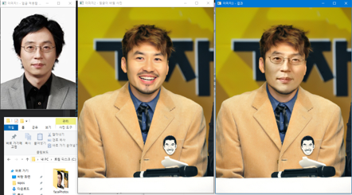
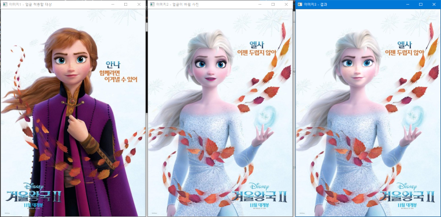
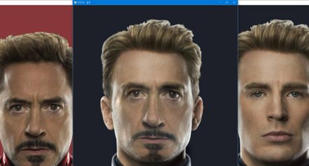
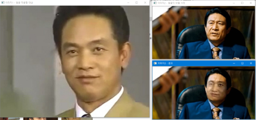

# OpenCV Faceswap project
:happy:

> 19.12.04
> cybertramp(paran_son@outlook.com)

OpencCV4를 사용하여 얼굴을 바꾸는 프로그램을 만드는 프로젝트입니다.

LearnOpenCV의 [faceswap](https://www.learnopencv.com/face-swap-using-opencv-c-python/)을 참고 하였습니다. 

해당 글과 달리 Dlib를 사용하지 않습니다. OpenCV4의 확장모듈인 facemark를 사용합니다.

## Process

1. harr_cascade를 통해 얼굴영역 검출
2. OpenCV 확장모듈 facemark를 통해 얼굴 랜드마크 검출
3. 랜드마크인 68개의 점을 convexHull을 통해 얼굴 영역 윤곽선 검출
4. 검출된 윤곽선을 통해 얼굴 블록을 얻고 들로니 삼각 분할을 통해 블록을 삼각형으로 분할
5. 분할된 삼각형들을 어파인 변형을 사용하여 적용될 이미지 얼굴 영역에 맞게 적용
6. SeamlessClone을 사용하여 얼굴 블록의 윤곽선과 얼굴 영역의 마스크 부분의 강도를 주변과 맞춤
7. 결과 출력

## Program function

해당 프로그램은 다음과 같은 기능을 실행할 수 있습니다.

1. Faceswap from images
2. Faceswap from images(DEBUG MODE)
3. FaceEyes Detect from Webcam
4. Facemark Detect from Webcam

## Required

- Windows 10 64bit
- OpenCV4 이상 버전
- OpenCV4 확장 모듈 중 facemark